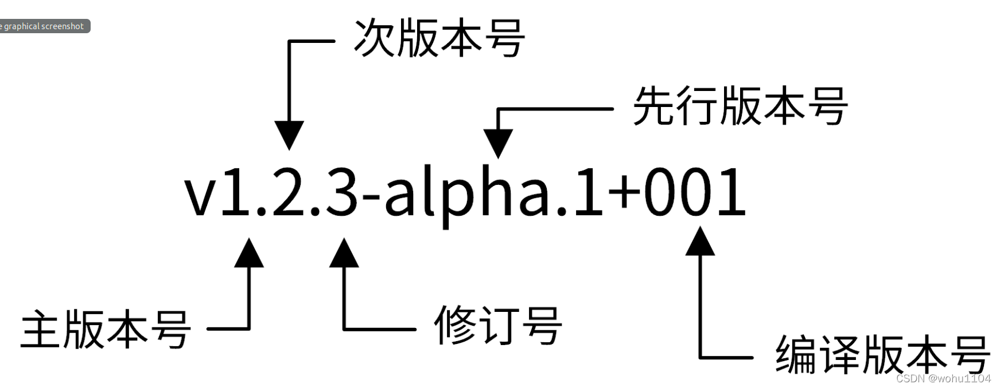
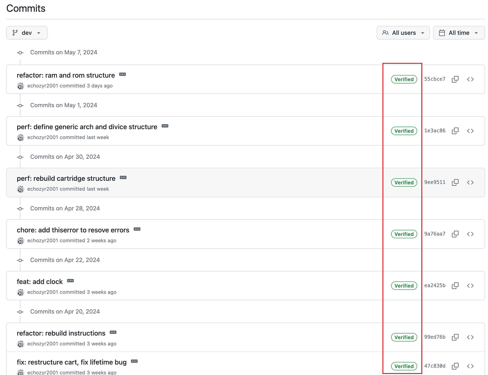
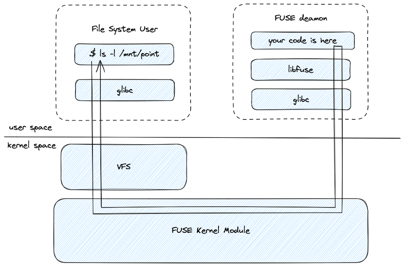
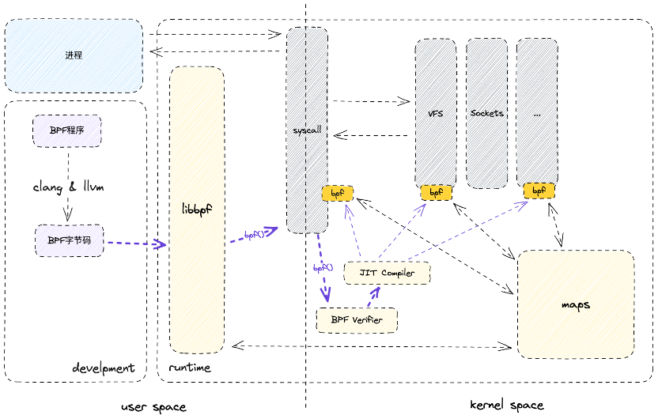
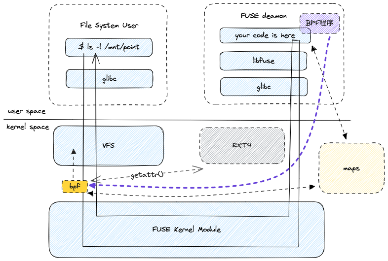
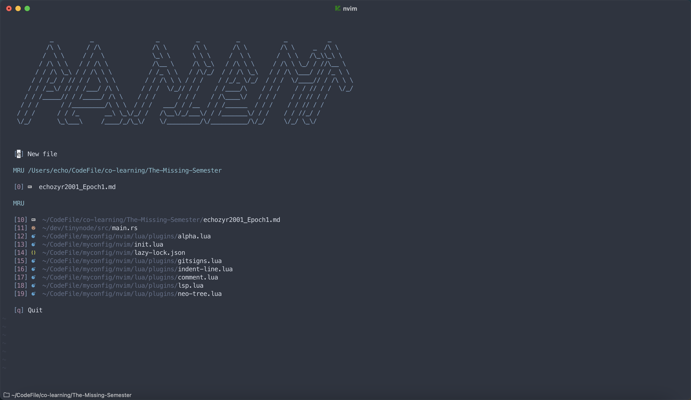
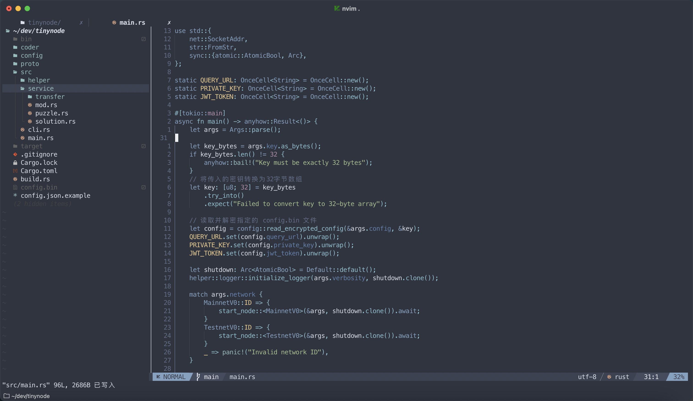

# CFC Studio 共学 Epoch1 指引

---

# [echozyr2001]

## 笔记证明

<!-- Content_START -->

### 01.06

> 学习时间：70 min

---

**主流 shell：** Bash、Zsh、Fish

**主流终端模拟器：** iTerm2、Alacritty、Hyper、Kitty、Terminus、Ghostty

---

“shell 是一个编程环境，所以它具备变量、条件、循环和函数”（之前没有从这个角度理解过）

如此理解的话，我们可以对比 lua、python 等脚本语言的执行环境。

---

```bash
-rw-r--r--
```

rwx 每三个字符构成一组。分别代表了文件所有者，用户组以及其他所有人具有的权限。

最前面的字符用来表示文件属性，`d` 表示目录，`l` 表示链接文件，`-` 表示普通文件。这三个字符可以分别对应一个二进制位，每一组的权限就可以用 `0～7` 来表示。

曾经遇到过一个问题，对于 `.pem` 这样的私钥文件，你必须将其权限设置为 `600` 才能使用（即 `-rw-------`），不然会遇到文件权限过大无法执行的问题。

---

**单引号与双引号在bash中的区别？**

> reference:
>
> https://www.gnu.org/software/bash/manual/html_node/Quoting.html

**shell 是如何知晓这个文件需要使用 sh 来解析呢？**

> reference:
>
> https://en.wikipedia.org/wiki/Shebang_(Unix)
>
> 在类 Unix 系统中像使用可执行文件那样使用一个文本文件时，程序加载器机制会将文件初始行进行解析，其中 `#!` 这部分被称为 `shebang`，除此之外的其他部分将被解析为指令。
>
> 例如，如果脚本以路径 `path/to/script` 命名，并且以 `#!/bin/sh` 开头，则指示程序加载器运行程序 `/bin/sh` ，传递 `path/to/script` 作为第一个参数。

---

**shell 的配置**

1. 安装 zsh

2. 安装插件管理器

- 轻量化 zinit： https://github.com/zdharma-continuum/zinit
- 重量级oh-my-zsh：https://ohmyz.sh/

3. 主题配置使用 starship：https://starship.rs/zh-CN/

---

文章中提到在 `echo` 这样的命令遇到空格时，需要使用 `"` 或转义字符，但是我发现在我的终端中，可以正常使用。

```zsh
➜  The-Missing-Semester git:(main) ✗ echo $SHELL
/bin/zsh
➜  The-Missing-Semester git:(main) ✗ echo hello world
hello world
```

起初我以为这是 `zsh` 的特殊功能，但是我发现在 ubuntu 上也是同样的结果

```bash
ubuntu@instance-20241225-1836:~$ echo $SHELL
/bin/bash
ubuntu@instance-20241225-1836:~$ echo hello world
hello world
```

在使用 `$ touch hello world` 时创建了 `hello` 和 `world` 两个文件，初步认为是 `echo` 命令的特殊。

---

讲环境变量部分，让我想到了 python 的虚拟环境

```bash
# This file must be used with "source bin/activate" *from bash*
# You cannot run it directly

deactivate () {
    # reset old environment variables
    if [ -n "${_OLD_VIRTUAL_PATH:-}" ] ; then
        PATH="${_OLD_VIRTUAL_PATH:-}"
        export PATH
        unset _OLD_VIRTUAL_PATH
    fi
    if [ -n "${_OLD_VIRTUAL_PYTHONHOME:-}" ] ; then
        PYTHONHOME="${_OLD_VIRTUAL_PYTHONHOME:-}"
        export PYTHONHOME
        unset _OLD_VIRTUAL_PYTHONHOME
    fi

    # Call hash to forget past commands. Without forgetting
    # past commands the $PATH changes we made may not be respected
    hash -r 2> /dev/null

    if [ -n "${_OLD_VIRTUAL_PS1:-}" ] ; then
        PS1="${_OLD_VIRTUAL_PS1:-}"
        export PS1
        unset _OLD_VIRTUAL_PS1
    fi

    unset VIRTUAL_ENV
    unset VIRTUAL_ENV_PROMPT
    if [ ! "${1:-}" = "nondestructive" ] ; then
    # Self destruct!
        unset -f deactivate
    fi
}

# unset irrelevant variables
deactivate nondestructive

# on Windows, a path can contain colons and backslashes and has to be converted:
case "$(uname)" in
    CYGWIN*|MSYS*)
        # transform D:\path\to\venv to /d/path/to/venv on MSYS
        # and to /cygdrive/d/path/to/venv on Cygwin
        VIRTUAL_ENV=$(cygpath "/Users/echo/CodeFile/Python/venv")
        export VIRTUAL_ENV
        ;;
    *)
        # use the path as-is
        export VIRTUAL_ENV="/Users/echo/CodeFile/Python/venv"
        ;;
esac

_OLD_VIRTUAL_PATH="$PATH"
PATH="$VIRTUAL_ENV/bin:$PATH"
export PATH

VIRTUAL_ENV_PROMPT="venv"
export VIRTUAL_ENV_PROMPT

# unset PYTHONHOME if set
# this will fail if PYTHONHOME is set to the empty string (which is bad anyway)
# could use `if (set -u; : $PYTHONHOME) ;` in bash
if [ -n "${PYTHONHOME:-}" ] ; then
    _OLD_VIRTUAL_PYTHONHOME="${PYTHONHOME:-}"
    unset PYTHONHOME
fi

if [ -z "${VIRTUAL_ENV_DISABLE_PROMPT:-}" ] ; then
    _OLD_VIRTUAL_PS1="${PS1:-}"
    PS1="(venv) ${PS1:-}"
    export PS1
fi

# Call hash to forget past commands. Without forgetting
# past commands the $PATH changes we made may not be respected
hash -r 2> /dev/null
```

通过修改 `bashrc` 等文件，来配置启动项，这些命令会在终端启动时自动执行。

```bash
export NVM_DIR="$HOME/.nvm"
  [ -s "/opt/homebrew/opt/nvm/nvm.sh" ] && \. "/opt/homebrew/opt/nvm/nvm.sh"  # This loads nvm
  [ -s "/opt/homebrew/opt/nvm/etc/bash_completion.d/nvm" ] && \. "/opt/homebrew/opt/nvm/etc/bash_completion.d/nvm"  # This loads nvm bash_completion

# export https_proxy=http://127.0.0.1:1082 http_proxy=http://127.0.0.1:1082 all_proxy=socks5://127.0.0.1:1082
export https_proxy=http://127.0.0.1:7897 http_proxy=http://127.0.0.1:7897 all_proxy=socks5://127.0.0.1:7897
export PATH="/opt/homebrew/opt/llvm/bin:$PATH"
export LIBRARY_PATH="$LIBRARY_PATH:$(brew --prefix)/lib"

alias python="python3"

alias c="clear"
alias i="cd ~/CodeFile"
alias ir="cd ~/CodeFile/Rust"
alias in="cd ~/CodeFile/node"
alias cb="cargo build"
alias cr="cargo run"
export DVM_DIR="/Users/echo/.dvm"
export PATH="$DVM_DIR/bin:/Users/echo/go/bin:$PATH"

source /Users/echo/.docker/init-zsh.sh || true # Added by Docker Desktop
```

对于单个用户来说，它们一般在用户的 home 目录下 `.bashrc` 或 `.zshrc`。对于全局来一般在 `/etc/profile` 或 `/etc/bashrc`。

> linux 配置环境变量如此简单，windows 就是 💩

---

`cd -` 命令，回到上一次的目录，可以用来在两个目录中跳转。

`ctrl l` 代替 `clear` 用来清屏。

`tee` 命令感觉很实用，有时间可以深入了解一下。

### 01.07

> 学习时间：60 min

---

**大多数 shell 都有自己的一套脚本语言，包括变量、控制流和自己的语法。**

据我所知，特别是 fish 的脚本语言与 bash 有很大不同。我们在写脚本时添加 `#!/bin/sh` 就能消除由于使用的 shell 不同导致脚本无法通用的问题。

---

高级 Bash 脚本编写指南：https://tldp.org/LDP/abs/html/special-chars.html

> `$0` - 脚本名
>
> `$1` 到 $9 - 脚本的参数。 $1 是第一个参数，依此类推。
>
> `$@` - 所有参数
>
> `$#` - 参数个数
>
> `$?` - 前一个命令的返回值
>
> `$$` - 当前脚本的进程识别码
>
> `!!` - 完整的上一条命令，包括参数。常见应用：当你因为权限不足执行命令失败时，可以使用 sudo !! 再尝试一次。
>
> `$_` - 上一条命令的最后一个参数。如果你正在使用的是交互式 shell，你可以通过按下 Esc 之后键入 . 来获取这个值。

---

tldr 命令：比 man 更简短的手册查询

---

||：“逻辑或” 操作，只有当左侧命令失败（退出状态码非 0）时，才会执行右侧命令。（两条命令中至少执行一个？）

&&：“逻辑与” 操作，只有当左侧命令成功（退出码为 0）时，才会执行右侧命令。（两台命令都要执行？）

---

<(CMD) 的作用是将命令 CMD 的输出提供给需要文件名作为输入的程序，而不是直接通过管道 | 传递数据。

> 没用过，抽时间熟悉

---

使用 `?` 和 `*` 来匹配一个或任意个字符。`*` 通配符知道，但是使用 `?` 匹配单个字符还是第一次了解。

`{}` 当命令中有公共子串时，可以用来简化命令。例如：

```bash
convert image.{png,jpg}
# 会展开为
convert image.png image.jpg

cp /path/to/project/{foo,bar,baz}.sh /newpath
# 会展开为
cp /path/to/project/foo.sh /path/to/project/bar.sh /path/to/project/baz.sh /newpath
```

---

`env` 命令，用于显示系统中存在的所有环境变量，用在 `shebang` 中可以增加脚本的通用性。

就拿 Python 来说，毕竟不是所有人都会讲它安装在相同的目录中，`#!/usr/bin/env python` 就能解决这个问题。

---

shellcheck 强大的 sh 脚本检查器

```
#!/bin/bash

# 检查PID文件是否存在
if [ ! -f zkrock.pid ]; then
  echo "PID file not found. Is zkrock running?"
  exit 1
fi

# 读取PID
PID=$(cat zkrock.pid)

# 停止进程
kill $PID

# 等待进程结束
sleep 1

# 检查进程是否成功停止
if ps -p $PID > /dev/null; then
   echo "Failed to stop zkrock. Force stopping..."
   kill -9 $PID
fi

# 删除PID文件
rm zkrock.pid

echo "Zkrock stopped."
```

检查出来有下面这些可以优化的地方

```
In stop.sh line 13:
kill $PID
     ^--^ SC2086 (info): Double quote to prevent globbing and word splitting.

Did you mean:
kill "$PID"


In stop.sh line 19:
if ps -p $PID > /dev/null; then
         ^--^ SC2086 (info): Double quote to prevent globbing and word splitting.

Did you mean:
if ps -p "$PID" > /dev/null; then


In stop.sh line 21:
   kill -9 $PID
           ^--^ SC2086 (info): Double quote to prevent globbing and word splitting.

Did you mean:
   kill -9 "$PID"
```

---

视频里讲了很多工具，我认为比较重要的是 `fzf` 和 `ripgrep`。有很多实用插件都是基于它们实现的。

---

课后练习暂时不做了

### 01.08

> 学习时间：70 min

---

`sed` 是一个流编辑器，可以用来替换文本中的内容，替换的命令为 `s` : `s/REGEX/SUBSTITUTION/`（这在 vim 中也很常用）

其中 `REGEX` 部分是正则表达式，`SUBSTITUTION` 是用于替换匹配结果的文本。

```bash
ssh myserver journalctl
 | grep sshd
 | grep "Disconnected from"
 | sed 's/.*Disconnected from //'
```

---

正则表达式在线调试工具：https://regex101.com/

正则表达式这部分让我想到了之前在学编译原理时还想自己实现一个正则解析器，收藏了很多资料但一直没有开始。等空下来可以去实现来玩玩。

正则表达式在某些情况下会非常复杂，它**是**万能的又**不是**万能的，若你要解析 `json` 等结构，有更好的工具可以使用，不用强求去使用正则。

---

平时的数据处理，我几乎只会使用 `cat` `tail` `grep`

`awk` 编程语言介绍：https://backreference.org/2010/02/10/idiomatic-awk/

推荐一个网站 **Learn x in y minutes（y 分钟学习 x）**：https://learnxinyminutes.com/

---

MLK DAY 马丁·路德·金纪念日 它们居然还会放假

---

数据处理这部分讲了很多工具的使用，没有太多可以记录的东西，主要是了解这些工具，日后遇到一些情况就可以使用它们。

工具一定是越用越熟练的，平时也需要有意识地去使用这些数据处理的工具。就算不用课程中讲到的工具，python、lua 等更现代的脚本语言也是一个很好的选择。

### 01.09

> 学习时间：60 min

---

vscode neovim 插件 https://marketplace.visualstudio.com/items?itemName=asvetliakov.vscode-neovim

一些配置

```json
{
  "vscode-neovim.neovimExecutablePaths.linux": "/usr/bin/nvim",
  "vscode-neovim.neovimInitVimPaths.linux": "$HOME/.config/nvim/init.lua",
  "vscode-neovim.compositeKeys": {
    "jk": {
      "command": "vscode-neovim.lua",
      "args": [
        "vim.api.nvim_input('<ESC>')\nrequire('vscode-neovim').action('workbench.action.files.save')"
      ]
    }
  }
}
```

---

- 行： 0 （行初）， ^ （第一个非空格字符）， $ （行尾）
- 屏幕： H （屏幕首行）， M （屏幕中间）， L （屏幕底部）

---

**宏**

`q{字符}` 来开始在寄存器 `{字符}` 中录制宏

`q` 停止录制

`@{字符}` 重放宏

---

因为本身比较熟悉 `vim` 的操作，所以这部分直接快速掠过了，仅记录了一些之前没用过以及觉得比较重要的内容。

然后花了一点时间来配置 `neovim`。（`neovim` 是更现代化的 `vim` 可以使用 `lua` 语言来进行配置）简单做些记录。

`neovim` 目前已经有很多成熟的配置 [Lazyvim](https://www.lazyvim.org/)、[NvChad](https://nvchad.com/)

初次尝试 `neovim` 可以选择其一进行体验，它们的官网中都提供了插件配置的教程，想要切换也非常简单，只需要删除或重命名 `~/.config/nvim` 文件夹，然后换上新的配置即可。

```bash
➜  ~ ls ~/.config | grep "nvim"
nvim
nvim.astron-back
nvim.lazy-back
nvim.self-back
nvim.tar.gz
```

我计划基于 https://github.com/nvim-lua/kickstart.nvim 进行配置，因为 `Lazyvim` 与 `NvChad` 的配置非常庞大与复杂（在 1c1g 的服务器上甚至能把内存干满），有很多我不需要的功能，一些快捷键也不是我习惯的，并且定制其中一些插件会非常复杂，牵一发而动全身。

`kickstart` 是一个非常精简的 neovim 初始配置。但也不是直接将它克隆下来然后做定制。而是从零开始配置，参考它的文件结构以及配置内容。

这样才能做到在最小的化的安装下尽可能满足自己的要求，日后做修改也非常容易，毕竟配置是自己一个字一个字写的。

### 01.10

> 学习时间：70 min

今天主要是在尝试对 `neovim` 进行配置，花了 20 分钟在 `learnxinyminutes` 上快速过了一遍 `lua` 语言，剩下时间主要在熟悉 `kickstart` 项目。

### 01.11

> 学习时间：70 min

主要在回顾本周内容，也有一些新的想法记录在下面：

---

`tee` 命令可以用来用做两个命令之间的连接。

> Read from `stdin` and write to `stdout` and files (or commands).

---

`foobar` 文化，在你不知道如何命名时通常使用它们，类似中文环境下的小明、小红。

---

常用文件描述符：

- `0` 表示 `stdin`
- `1` 表示 `stdout`
- `2` 表示 `stderr`
- `/dev/null` 表示空文件

`stdout` 和 `stderr` 默认都是将信息输出到终端上，但是它们还是有区别。

```C
int main(){
  fprintf(stdout,"Hello ");
  fprintf(stderr,"World!");
  return0;
}
```

上面这段代码的输出是 `World!Hello `。

在默认情况下，`stdout` 是行缓冲的，他的输出会放在一个 `buffer` 里面，只有到换行的时候，才会输出到屏幕。而 `stderr` 是无缓冲的，会直接输出。

---

在不知道脚本运行文件的位置时，使用 `#!/usr/bin/env <CMD>`

---

**到底什么是 Shell**

shell 直译过来是 “外壳”，它是一种特殊的用户程序，给用户提供了使用操作系统服务的接口。shell 接受用户输入的人类可读的命令，并将其转换为内核可以理解的内容，当用户启动终端时，shell 就会启动。

shell 有两类：命令行 shell（CLI） 和图形 shell（GUI）。

shell 也是一种编程语言，与我们常见的脚本语言 python、lua 类似，它们都有一个交互式编程环境，这个环境叫做 `REPL`（Read-Eval-Print-Loop）。我们使用 shell 其实就是在使用它的 REPL。

---

继续 `neovim` 的配置

### 01.12

> 学习时间：120 min

`kill` 命令经常用，但是不知道使用 `-9` 选项有什么作用，下面是 GPT 给我的答案：

> kill 命令可以发送多种信号给进程，默认情况下，它发送 SIGTERM 信号（信号编号 15），这是请求进程正常结束的信号。以下是一些常用的信号：
>
> - SIGTERM (15)：请求进程正常终止，允许进程清理资源和文件等。进程可以选择忽略这个信号。
> - SIGKILL (9)：强制立即终止进程，无法被进程捕获或忽略。通常用于终止无法正常结束的进程。
> - SIGINT (2)：通常由用户通过按下 Ctrl + C 发送给前台进程，用于中断进程。
> - SIGHUP (1)：通常用于通知进程重新加载配置文件，或者由于连接丢失而终止进程。
> - SIGSTOP (19)：暂停（挂起）进程，不能被进程捕获或忽略。与 SIGCONT 相反，后者用于恢复暂停的进程。

> `SIGKILL` 是一个特殊的信号，它不能被进程捕获并且它会马上结束该进程。不过这样做会有一些副作用，例如留下孤儿进程。（不知道竟然还会有这样的问题。）

---

`Ctrl-Z` 会暂停一个进程。

`fg` 和 `bg` 命令可以恢复暂停的工作。它们分别表示在前台继续或在后台继续。

`jobs` 命令会列出当前终端会话中尚未完成的全部任务。

---

**tmux 使用与配置**

之前用过一段时间 tmux 但是觉得操作挺复杂，并且没有配置好，就没有使用了。后面还是应该用起来。

tmux 快速入门教程 https://hamvocke.com/blog/a-quick-and-easy-guide-to-tmux/

---

**Dotfiles**

> 我们应该如何管理这些配置文件呢，它们应该在它们的文件夹下，并使用版本控制系统进行管理，然后通过脚本将其 符号链接 到需要的地方。

这也是我管理配置文件的方式。

**配置的可移植性**

之前有考虑过这个问题，但是也是觉得太复杂了就没有去弄

```shell
if [[ "$(uname)" == "Linux" ]]; then {do_something}; fi

# 使用和 shell 相关的配置时先检查当前 shell 类型
if [[ "$SHELL" == "zsh" ]]; then {do_something}; fi

# 您也可以针对特定的设备进行配置
if [[ "$(hostname)" == "myServer" ]]; then {do_something}; fi
```

---

关于 ssh 密钥，通常我们使用 `ssh-copy-id` 命令来实现免密登陆，可以避免手动复制错误导致的问题。

---

关于上传文件到服务器中，我发现居然大部分人还不知道有 `scp` 命令。

---

pgrep 与 pkill，我们不用先去查进程号，可以直接通过进程名来查找与终止进程

---

使用 `dotfiles` 管理配置文件，我们需要手动 `ln -s` 去链接配置文件，也可以使用一些用于管理配置文件的工具：https://dotfiles.github.io/utilities/

---

**ssh 参数**

`-N` 就是不执行远端命令，适用于端口转发的情况，`-f` 是让 ssh 在执行命令前切换到后台运行。

后台进行端口转发 `ssh -fN -L 9999:localhost:8888 user@remotehost`

---

**一个有趣的问题**

> https://unix.stackexchange.com/questions/185793/why-is-it-while-kill-0-pid-and-not-until-kill-0-pid

我们需要明确的是：**在 Shell 中 ‘0’ 表示成功，非零表示失败**。

在 bash 脚本中 `while` 命令不是寻找布尔值，而是寻找返回码 `0`，这表明命令执行成功。因此，在 `while` 命令的情况下，返回 `0` 的命令是**真**，其他任何值都是**假的**。

```bash
while compound-list-1
do
    compound-list-2
done
```

将执行 `compound-list-1`，如果它具有非零退出状态，则 `while` 命令将完成。否则，将执行 `compound-list-2`，并重复该过程。

### 01.13

> 学习时间： 60 min

---

```
feat	    新特性，新功能
fix	      修bug
docs	    更新文档
style	    修改代码风格、代码格式（不影响代码运行的变动）
refactor	重构代码（既不是新增功能，也不是修改bug，可以理解为觉得原本写太烂了，重新写了一遍）
perf	    优化性能、优化体验
test	    测试
chore	    构建过程或者辅助工具的变动
revert	  回滚版本
merge	    代码合并
sync	    同步主线或分支
```

比较好用的一个查看提交记录的命令 `git log --graph --all --decorate --oneline`

---

简单来讲，git 存储的是 `object` 的有向无环图（DAG），

**基本结构**

```text
type blob = array<byte>

type tree = map<string, tree | blob>

type commit = struct {
    parents: array<commit>
    author: string
    message: string
    snapshot: tree
}

type object = blob | tree | commit
```

**寻址结构**

```text
objects = map<string, object>

def store(object):
    id = sha1(object)
    objects[id] = object

def load(id):
    return objects[id]
```

**引用**

```text
references = map<string, string>

def update_reference(name, id):
    references[name] = id

def read_reference(name):
    return references[name]

def load_reference(name_or_id):
    if name_or_id in references:
        return load(references[name_or_id])
    else:
        return load(name_or_id)
```

> 当您输入某个指令时，请思考一下这条命令是如何对底层的图数据结构进行操作的。

---

如何编写良好的 git commit message：https://cbea.ms/git-commit/

---

一个使用 Rust 实现的轻量 git 项目：https://github.com/MrBeanCpp/MIT

---

### 01.14

> 学习时间：60 min

元编程：用于操作程序的程序

无论使用什么语言进行开发，我们的项目都少不了一个构建的过程，这通常涉及编译、打包、测试以及 benchmark，用来完成这些步骤的工具被称为“构建系统”。

我们知道，实际开发前的环境搭建才是最折磨的，一个好的脚手架可以帮助我们解决开发前搭建环境的步骤。但不是所有语言都有这种脚手架，我最近发现了一个工具 `cookiecutter`：https://github.com/cookiecutter/cookiecutter，它为我们提供了各种项目的初始化模板。

但我目前只发现了一个比较好用的 python 初始化模版：https://github.com/pyloong/cookiecutter-pythonic-project。

下面是它的文档：

https://pyloong.github.io/pythonic-project-guidelines/quick_start/#252

https://pyloong.github.io/cookiecutter-pythonic-project/#git-per-commit

关于 typescript 可以参考这里：https://simonboisset.com/blog/create-typescript-library-tsup

---

**语义化版本**

之前一直想总结语义化版本相关的内容，借此机会将收藏夹里的文档翻出来整理。

语义化版本格式为：主版本号.次版本号.修订号（`X.Y.Z`）其中 `X`、`Y` 和 `Z` 均为非负整数，
**且禁止在数字前方补零**。

版本号按以下规则递增：

- 所有版本号都以 `v` 开头。
- 主版本号：发生了与之前版本不兼容的更新时修改。
- 次版本号：发生了向下兼容的更新时修改，这里有一个不成文的规定：偶数为稳定版，奇数为开发版。
- 修订号：发生了向后兼容的 `bug` 修复时修改。

还有这么一种版本号 `v1.2.3-alpha`，这是将先行版本号和版本编译元数据作为补充添加到了版本号中。如下图所示：



先行版本号意味着该版本不稳定，可能存在兼容性问题。编译版本号一般是编译器在编译过程中自动生成的，
我们只定义其格式，并不人为控制。

**规范**

- 以标记版本的软件发布后，禁止改变其内容，任何修改都必须以新的版本发布。
- 修订号必须在只做了向下兼容的 `bug` 修订时才递增。
- 次版本号必须在有向下兼容的新功能出现时递增。其中可以包括修订级别的改变，每当次版本号递增时，修定号必须归零。
- 主版本号必须在有任何不兼容的更新时递增。其中可以包括次版本以及修订级别的改变，每当主版本号递增时，次版本号和修订号必须归零。

**实际开发中如何确定版本号**

一般使用 `0.1.0` 作为第一个开发版本号，当软件稳定，且第一次对外发布时，版本号可以定为 `1.0.0` 每次代码的提交可以按照以下规则与版本号对应：

1. `fix` 类型的提交可以将修订号 `+1`
2. `feat` 类型的提交可以将次版本号 `+1`
3. `BREAKING CHANGE` 的提交可以将主版本号 `+1`

---

`CI`：持续集成，代码提交后自动运行一系列测试，以确保新代码没有破坏现有功能。

`CD`：持续交付，通过测试之后的代码自动部署到生产环境中。

有一种专门的岗位叫 `DevOps` 工程师，`CI/CD` 就是他们的核心职责。

---

### 01.15

> 学习时间：40 min

密码散列函数：https://en.wikipedia.org/wiki/Cryptographic_hash_function，可以将任意大小的数据映射为一个固定大小的输出。我之前一直想实现类似的效果，原来已经有现成的实现了。

**sha-1 sha-2 sha-3**

SHA（安全哈希算法）目前主要有三个版本：

1. **`sha-1`**
   生成固定长度的 160 位哈希值。由于算法设计的局限性，在 2005 年后发现了严重的安全缺陷。

2. **`sha-2`**
   在 `sha-1` 的基础上增加了安全性和抵御攻击的能力，包含 `sha-224`、`sha-256`、`sha-384` 和 `sha-512` 多个算法变体，提供不同的输出长度。目前被广泛使用。

3. **`sha-3`**
   设计上完全独立于 `sha-1` 和 `sha-2`，不受已知或潜在弱点影响。由于在当前技术条件下，`sha-3` 并没有显示出明显的效率优势，且 `sha-2` 目前仍足够安全，所以普及速度较慢。但它被广泛接受为替代 `sha-2` 的下一代哈希算法。

---

**为 commit 添加签名**



以下内容记录在我的旧笔记中，仅做分享，目前不一定适用。

1. 使用 brew 安装 gpg

```shell
brew install gpg
```

2. 生成 GPG 密钥对

```shell
gpg --full-generate-key
```

3. 在提示时，指定要生成的密钥类型，或按 `Enter` 键接受默认值。

4. 在提示时，指定要生成的密钥大小，或按 `Enter` 键接受默认值。

5. 输入密钥的有效时长。 按 `Enter` 键将指定默认选择，表示该密钥不会过期。 除非你需要过期日期，否则建议接受此默认值。

6. 验证您的选择是否正确。

7. 输入您的用户 ID 信息。

> 确保输入的是电子邮件地址 经过验证的GitHub 帐户。

8. 输入安全密码。

9. 列出你拥有其公钥和私钥的长形式 GPG 密钥。 签名提交或标记需要私钥。

```shell
gpg --list-secret-keys --keyid-format=long
```

10. 从 GPG 密钥列表中复制您想要使用的 GPG 密钥 ID 的长形式。 在本例中，GPG 密钥 ID 为 `3AA5C34371567BD2`

```shell
$ gpg --list-secret-keys --keyid-format=long
/Users/hubot/.gnupg/secring.gpg
------------------------------------
sec   4096R/3AA5C34371567BD2 2016-03-10 [expires: 2017-03-10]
uid                          Hubot <hubot@example.com>
ssb   4096R/4BB6D45482678BE3 2016-03-10
```

11. 粘贴下面的文本（替换为您要使用的 GPG 密钥 ID）。 在本例中，GPG 密钥 ID 为 `3AA5C34371567BD2`：

```shell
gpg --armor --export 3AA5C34371567BD2
# Prints the GPG key ID, in ASCII armor format
```

12. 复制以 `-----BEGIN PGP PUBLIC KEY BLOCK-----` 开头并以 `-----END PGP PUBLIC KEY BLOCK-----` 结尾的 GPG 密钥。

**将 GPG 密钥添加到 GitHub 帐户**

1. 进入设置

2. 进入“SSH 和 GPG 密钥”。

3. 单击“新建 GPG 密钥”

4. 在“标题”字段中键入 GPG 密钥的名称

5. 在“密钥”字段中，粘贴复制的 GPG 密钥

6. 单击“添加 GPG 密钥”

**将您的签名密钥告知 Git**

1. 如果之前已将 Git 配置为在使用 `--gpg-sign` 签名时使用不同的密钥格式，请取消设置此配置，以便使用默认 `openpgp` 格式。

```shell
git config --global --unset gpg.format
```

2. 列出你拥有其公钥和私钥的长形式 GPG 密钥。 签名提交或标记需要私钥。

```shell
gpg --list-secret-keys --keyid-format=long
```

3. 从 GPG 密钥列表中复制您想要使用的 GPG 密钥 ID 的长形式。 在本例中，GPG 密钥 ID 为 `3AA5C34371567BD2`：

```shell
$ gpg --list-secret-keys --keyid-format=long
/Users/hubot/.gnupg/secring.gpg
------------------------------------
sec   4096R/3AA5C34371567BD2 2016-03-10 [expires: 2017-03-10]
uid                          Hubot <hubot@example.com>
ssb   4096R/4BB6D45482678BE3 2016-03-10
```

4. 若要在 Git 中设置 GPG 签名主键，请粘贴下面的文本，替换要使用的 GPG 主键 ID。 在本例中，GPG 密钥 ID 为 `3AA5C34371567BD2`：

```shell
git config --global user.signingkey 3AA5C34371567BD2
```

5. 将 Git 配置为默认对所有提交进行签名（可选）

```shell
git config --global commit.gpgsign true
```

**对提交签名**

1. 当本地分支中的提交更改时，请将 S 标志添加到 git commit 命令：

```shell
$ git commit -S -m "YOUR_COMMIT_MESSAGE"
# Creates a signed commit
```

2. 可能会遇到如下问题

```shell
gpg: signing failed: Inappropriate ioctl for device
```

解决方法如下（任选其一）：

一、使用 GPG 的 TTY 模式

- 设置 GPG 使用终端 (TTY) 来提示输入 PIN。您可以通过在 `~/.gnupg/gpg.conf` 文件中添加以下行来实现这一点：

```shell
use-agent
pinentry-mode loopback
```

- 然后，在 `~/.gnupg/gpg-agent.conf` 文件中添加以下行：

```shell
allow-loopback-pinentry
```

- 之后，重启 gpg-agent：

```shell
gpg-connect-agent reloadagent /bye
```

二、使用`GPG_TTY`环境变量（未验证）

- 在shell 配置文件中（如 `~/.bashrc` 或 `~/.zshrc`），添加以下行：

```shell
export GPG_TTY=$(tty)
```

- 然后，重新加载 shell 配置：

```shell
source ~/.bashrc 或 source ~/.zshrc
```

三、使用不需要PIN的GPG密钥（未验证）

- 如果 GPG 密钥不需要 PIN，可以尝试生成一个不需要 PIN 的新密钥，并在 Git 中使用这个密钥进行签名。

3. 在本地完成创建提交后，将其推送到 GitHub 上的远程仓库：

```shell
$ git push
# Pushes your local commits to the remote repository
```

---

**零知识证明（ZKP）**

区块链本身的一个关键优势就是透明性，然而在许多情况下，一些合约处于商业或法律因素需要保障数据隐私。在区块链中采用 ZKP 技术，可以证明某条隐藏信息是有效且为证明者所拥有的。

如果要用一个概念直观地解释零知识证明如何证明用户拥有数据，可以想象一个山洞只有一个入口，洞里面有两条路（路径A和路径B），这两条路由一扇门连接，要说出密码才能通过这扇门。Alice 希望向 Bob 证明她知道开门的密码，但不想将密码透露给 Bob。

为了完成这个证明，Bob 需要站在山洞外，Alice 从其中一条路走进山洞，而 Bob 并不知道她选了哪条路。接着，Bob 指定 Alice 从其中一条路回到山洞入口（注：这是随机选择的）。如果 Alice 最初选择从路径 A 走到门口，但 Bob 让她从路径 B 回来，唯一的方法就是穿过那扇门，而穿过门必须知道密码。为了充分证明 Alice 真的知道门的密码，而不是运气好刚好选到了同一条路，这个过程可以反复重复好几次。

这一步操作完成后，Bob 就可以非常确信 Alice 知道门的密码，与此同时 Alice 也不用向 Bob 透露密码是什么。

zkSync：https://zksync.io/，通过 `zkRollup` 技术支持的以太坊二层网络扩展。

Aleo：https://aleo.org/，第一条使用零知识证明技术的公链。

---

### 01.16

> 学习时间：20 min

今天大部分时间花在了开发自动 `notify` 机器人上，然后快速将之前跳过的一些内容过了一遍，比较简单且以实操为主，没有什么值得记录的东西，今天就摸了。

### 01.17

> 学习时间：60 min

在看最后大杂烩部分的时候看到了 `FUSE` 的内容，我自己在综合课设三做的就是 `FUSE` 的相关内容，这里就整理一下当时所做的内容吧。

`FUSE` 即用户态文件系统（Filesystem in User-Space）允许用户在用户空间而非内核空间实现文件系统，这样可以降低开发难度，提高开发效率，同时也避免了因内核空间的错误操作导致系统崩溃。

但是 `FUSE` 在实际的应用中存在较大的性能瓶颈。由于 `FUSE` 的大部分操作发生在用户态，但是像 `inode` 这样的文件数据依然只有内核能够操作，于是在用户态与内核态之间存在大量的数据拷贝消耗 `CPU` 算力，导致 `FUSE` 的性能表现不佳。

为了解决这一问题，我们可以利用 Linux 内核的新特性 `eBPF` 来提高数据传输的效率。`eBPF` 允许用户在内核中安全地运行自定义逻辑，而无需修改内核代码，利用 `eBPF` 可以实现在用户态和内核态之间共享数据而无需内存拷贝，这为实现高性能用户态文件系统接口提供了可能。

为了深入理解 `FUSE` 的性能特点以及潜在的优化空间，我们首先对基于 `FUSE` 实现的文件系统操作流程进行分析。

`SSHF` 是基于 `FUSE` 接口和 `SSH` 协议实现的文件系统，它允许用户通过安全的加密通道远程挂载和访问远程文件系统。下面是在 `SSHFS` 上使用 `ls` 命令列出目录中的文件和子目录的过程。



`FUSE` 接口其实是一个简单的**客户端-服务器**协议，它的客户端是内核，用户态的守护进程就是服务端，内核模块会通过 `VFS` 暴露 `/dev/fuse` 设备文件，这个虚拟设备文件就是内核模块和用户程序的数据通路。

所谓**用户态文件系统**，指的是一个文件系统的 `data` 和 `metdata` 都是由用户态的进程而不是内核提供的（这种进程也就是 `deamon`）。

但是用户态文件系统并不代表其完全不需要内核的参与，因为在 Linux 中，对文件的访问都是统一通过 `VFS` 层提供的内核接口进行的。基本流程可理解如下：

1. 当一个进程访问文件时，通过基本库 `glibc` 调用系统调用将请求传递给内核 `VFS`。
2. 由 `VFS` 判断请求属于某个用户态文件系统，并将请求转发给内核 `FUSE` 模块。
3. `FUSE` 模块将请求转换为与 `deamon` 约定的协议格式传递给 `deamon` 进程。
4. `deamon` 进程通过用户态库 `libfuse` 解析请求并处理。处理之后，响应原路返回。

我们接下来分析 `eBPF` 的实现原理：



我们首先需要在用户态编写 `eBPF` 内核程序，并通过 `lang` 与 `llvm` 编译为 `BPF` 字节码。下一步是将这个字节码加载到内核中以供执行。这个过程通常由 `eBPF` 用户程序完成，它利用操作系统提供的 `libbpf` 库来与内核进行交互，具体流程如下：

1. `eBPF` 用户程序通过 `libbpf` 库封装的 `bpf()` 函数发起系统调用，将 `BPF` 字节码加载到内核 `BPF Verifier` 模块中。该模块负责检查 `BPF` 字节码的正确性和安全性，以防止恶意代码破坏内核稳定性。
2. 通过验证的字节码将被传递给 `JIT Compiler` 模块，该模块将字节码编译为机器码，以便在内核中执行，该机器码遵循 `eBPF` 指令集，并将机器码与用户指定的函数、系统调用或数据通路关联起来。当内核执行到关联点时，`eBPF` 内核程序将会被触发并执行。

同时内核模块会在内核中维护一个 `maps` 映射表集合，这些集合由若干哈希表组成。`maps` 提供了一种在用户态和内核态之间共享数据的机制。用户态程序可以通过 `libbpf` 库直接访问 `maps` 中的内容，实现用户态与内核态之间的数据共享和交互。

这里跳过枯燥的资料查阅过程，直接给出结论，`getattr()` 和 `getxattr()` 函数是性能瓶颈的关键因素，它们分别用于获取文件或目录的基本属性信息和扩展属性信息。这两个函数的频繁调用会导致大量的系统调用和上下文切换，从而降低文件系统的性能和响应速度。通过 `eBPF` 技术，可以在内核中拦截和处理相关操作，从而避免不必要的 `getattr()` 和 `getxattr()` 函数调用。

具体而言，为了减少 `getattr()` 和 `getxattr()` 函数的执行次数，可以利用 `eBPF` 的 `maps` 机制分别维护两个映射表。这样的映射表可以用于存储已经获取过的文件或目录的基本属性信息和扩展属性信息。

通过编写相应的 `eBPF` 程序，并将其挂载到 `getattr()` 和 `getxattr()` 函数上。当需要获取文件或目录的基本属性信息或扩展属性信息时，首先在映射表中查找相应的条目。如果已经存在于映射表中，就可以直接从映射表中获取所需的属性信息，而不需要再次执行这两个函数。这样可以有效减少函数的调用次数，提高性能。

需要注意的是，当文件或目录的属性发生变化时，例如文件大小、修改时间或扩展属性的更新，需要及时更新映射表中的对应信息。可以通过事件触发机制或周期性检查来实现对映射表的更新，确保映射表中存储的属性信息与实际文件系统的属性保持一致。

下面是优化后的系统架构：



主要包括三大模块的设计：用户态主控模块、函数调用拦截模块和共享数据 `maps` 映射模块。

**用户态主控模块**：该模块负责整个系统的控制和协调。在系统启动时，用户态主控模块首先加载经过编译的 `eBPF` 字节码到内核，并将其挂载在 `getattr()` 和 `getxattr()` 函数上。通过与内核进行数据交流，用户态主控模块实现文件系统的基本功能，并充当用户态守护进程，等待用户操作和请求。

**函数调用拦截模块**：该模块将被编译为 `BPF` 字节码等待主控模块挂载。当 `getattr()` 或 `getxattr()` 函数被调用时，函数调用拦截模块与共享数据映射模块进行交互。通过查询文件（或目录）的 `inode` 属性，函数调用拦截模块在共享数据映射模块中查找相应的映射表条目，并根据查找结果决定是否拦截函数调用或放行函数调用。

**共享数据 `maps` 映射模块**：该模块作为用户态与内核态之间数据交互的桥梁，负责维护映射表以实现数据的共享和访问。当函数调用被拦截时，共享数据映射模块根据文件的 `inode` 属性返回相应的信息给函数调用拦截模块。同时，当文件的属性发生变化时，共享数据映射模块从用户态获取最新的属性信息，并根据文件的 `inode` 属性更新映射表中相应的条目。

上面的设计还停留在理论阶段，具体实现没有完成，大家感兴趣的话可以尝试实现或优化。

### 01.18

> 学习时间：120 min

花费两个小时配置 `neovim`，遇到一个问题 `lsp` 插件找不到 `tsserver`，卡了很久都没法解决，结果查文档发现是名字写错了，应该是 `ts_ls`，鉴定为太久没用 `neovim` 被 `vscode` 污染思维了。

### 01.19

> 学习时间：60 min

虽然主要内容已经看完了，但 21 天的安排还是需要有始有终，后面应该主要关注在各种工具的配置上。

今天依然是在配置 `neovim`，经过两天的配置，基本的文件浏览器、语法检查、自动补全都已经配置好了，现在的效果如图所示。





### 01.20

> 学习时间：90 minutes

继续进行 `neovim` 的配置，主要是优化了基本设置 `options` 和快捷键 `keymaps`

```lua
-- options.lua

local opt = vim.opt

opt.relativenumber = true -- set relative numbered lines
opt.number = true -- Make line numbers default

opt.tabstop = 4 -- insert n spaces for a tab
opt.shiftwidth = 4 -- the number of spaces inserted for each indentation
opt.expandtab = true -- convert tabs to spaces
opt.autoindent = true -- copy indent from current line when starting new one

opt.wrap = false -- display lines as one long line

opt.ignorecase = true -- Case-insensitive searching UNLESS \C or capital in search
opt.smartcase = true -- smart case

opt.cursorline = true -- highlight the current line

opt.termguicolors = true -- set termguicolors to enable highlight groups

opt.background = "dark" -- colorschemes that can be light or dark will be dark
opt.signcolumn = "yes" -- Keep signcolumn on by default

opt.backspace = "indent,eol,start" -- allow backspace on

opt.clipboard:append("unnamedplus") -- Sync clipboard between OS and Neovim.

opt.splitright = true -- force all vertical splits to go to the right of current window
opt.splitbelow = true -- force all horizontal splits to go below current window

vim.o.hlsearch = false -- Set highlight on search
vim.o.mouse = "a" -- Enable mouse mode
vim.o.breakindent = true -- Enable break indent
vim.o.undofile = true -- Save undo history
vim.o.updatetime = 250 -- Decrease update time
vim.o.timeoutlen = 300 -- time to wait for a mapped sequence to complete (in milliseconds)
vim.o.backup = false -- creates a backup file
vim.o.writebackup = false -- if a file is being edited by another program (or was written to file while editing with another program), it is not allowed to be edited
vim.o.completeopt = "menuone,noselect" -- Set completeopt to have a better completion experience
vim.o.whichwrap = "bs<>[]hl" -- which "horizontal" keys are allowed to travel to prev/next line
vim.o.linebreak = true -- companion to wrap don't split words
vim.o.scrolloff = 4 -- minimal number of screen lines to keep above and below the cursor
vim.o.sidescrolloff = 8 -- minimal number of screen columns either side of cursor if wrap is `false`
vim.o.numberwidth = 4 -- set number column width to 2 {default 4}
vim.o.softtabstop = 4 -- Number of spaces that a tab counts for while performing editing operations
vim.o.swapfile = false -- creates a swapfile
vim.o.smartindent = true -- make indenting smarter again
vim.o.showmode = false -- we don't need to see things like -- INSERT -- anymore
vim.o.showtabline = 2 -- always show tabs
vim.o.pumheight = 10 -- pop up menu height
vim.o.conceallevel = 0 -- so that `` is visible in markdown files
vim.o.fileencoding = "utf-8" -- the encoding written to a file
vim.o.cmdheight = 1 -- more space in the neovim command line for displaying messages
vim.opt.shortmess:append("c") -- don't give |ins-completion-menu| messages
vim.opt.iskeyword:append("-") -- hyphenated words recognized by searches
vim.opt.formatoptions:remove({ "c", "r", "o" }) -- don't insert the current comment leader automatically for auto-wrapping comments using 'textwidth', hitting <Enter> in insert mode, or hitting 'o' or 'O' in normal mode.
vim.opt.runtimepath:remove("/usr/share/vim/vimfiles") -- separate vim plugins from neovim in case vim still in use
```

```lua
-- keymaps.lua

-- leader key
vim.g.mapleader = " "
vim.g.maplocalleader = " "

-- for conciseness
local keymap = vim.keymap

-- Press jk fast to exit insert mode
keymap.set("i", "jk", "<ESC>", { desc = "Exit insert mode with jk" })

keymap.set("n", "<leader>nh", "<cmd>nohl<CR>", { desc = "Clear search highlights" })

-- disable the spacebar key's default bebavior in n and v modes
keymap.set({ "n", "v" }, "<Space>", "<Nop>", { silent = true })

-- window
keymap.set("n", "<leader>sv", "<C-w>v", { desc = "Split window vertically" })
keymap.set("n", "<leader>sh", "<C-w>s", { desc = "Split window horizontally" })
keymap.set("n", "<leader>se", "<C-w>=", { desc = "Make splits equal size" })
keymap.set("n", "<leader>sx", "<cmd>close<CR>", { desc = "Close current split" })

-- save file
vim.keymap.set("n", "<C-s>", "<cmd> w <CR>")

-- disable copy into register
vim.keymap.set("n", "x", '"_x')

-- save file without auto-formatting
vim.keymap.set("n", "<leader>sn", "<cmd> noautocmd w <CR>")

-- quit file
vim.keymap.set("n", "<C-q>", "<cmd> q <CR>")

-- find and center
vim.keymap.set("n", "n", "nzzzv")
vim.keymap.set("n", "N", "Nzzzv")

-- -- resize
-- vim.keymap.set('n', '<Up>', '<cmd> resize -2 <CR>', opts)
-- vim.keymap.set('n', '<Down>', '<cmd> resize +2 <CR>', opts)
-- vim.keymap.set('n', '<Left>', '<cmd> vertical resize -2 <CR>', opts)
-- vim.keymap.set('n', '<Right>', '<cmd> vertical resize +2 <CR>', opts)
--
-- -- buffers
-- vim.keymap.set('n', '<Tab>', '<cmd> bnext <CR>', opts)
-- vim.keymap.set('n', '<S-Tab>', '<cmd> bprevious <CR>', opts)
-- vim.keymap.set('n', '<leader>x', '<cmd> Bdelete! <CR>', opts)
-- vim.keymap.set('n', '<leader>b', '<cmd> enew <CR>', opts)
--

-- toggle line wrapping
vim.keymap.set("n", "<leader>lw", "<cmd> set wrap! <CR>", opts)
```

### 01.20

> 学习时间：30 min

今天将 `tmux` 配置好了

```text
set -g default-terminal "screen-256color"

set -g prefix C-a
unbind C-b
bind-key C-a send-prefix

unbind %
bind | split-window -h

unbind '"'
bind - split-window -v

unbind r
bind r source-file ~/.tmux.conf

bind -r j resize-pane -D 5
bind -r k resize-pane -U 5
bind -r l resize-pane -R 5
bind -r h resize-pane -L 5

bind -r m resize-pane -Z

set -g mouse on

set-window-option -g mode-keys vi

bind-key -T copy-mode-vi 'v' send -X begin-selection # start selecting text with "v"
bind-key -T copy-mode-vi 'y' send -X copy-selection # copy text with "y"

unbind -T copy-mode-vi MouseDragEnd1Pane # don't exit copy mode when dragging with mouse

# tpm plugin
set -g @plugin 'tmux-plugins/tpm'

# list of tmux plugins
set -g @plugin 'christoomey/vim-tmux-navigator'
set -g @plugin 'tmux-plugins/tmux-resurrect' # persist tmux sessions after computer restart
set -g @plugin 'tmux-plugins/tmux-continuum' # automatically saves sessions for you every 15 minutes

# Color Theme
set -g @plugin "arcticicestudio/nord-tmux"

set -g @resurrect-capture-pane-contents 'on'
set -g @continuum-restore 'on'

# Initialize TMUX plugin manager (keep this line at the very bottom of tmux.conf)
run '~/.tmux/plugins/tpm/tpm'

```

<!-- Content_END -->
